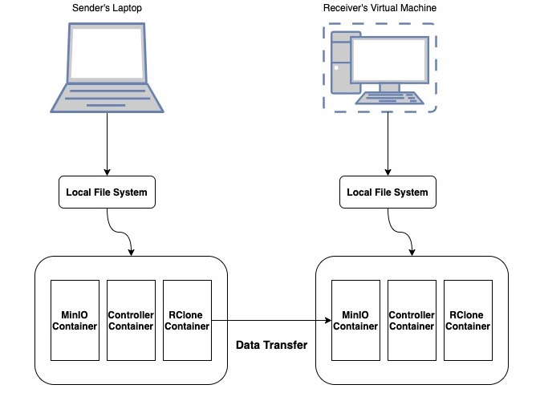
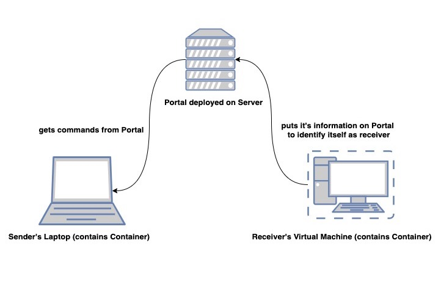

# Data-Transfer-Node-in-a-Box

# 1. Vision and Goals Of The Project:

We are reaching a point in science where our ability to generate and collect experimental data is outstripping our ability to move, store and reliably retrieve it. To realize the maximum impact of trillions of dollars of global research the results from those experiments need to be accessible to as wide a community as possible. Whereas research results in the past were neatly summarized in research papers totaling kilobytes, modern research generates artifacts that are an order of a billion times larger (petabyte scale). While storage and networking hardware have advanced apace with this torrent of data, their orchestration - the ability to share and move large datasets globally - lags painfully.

The project aims to make large data transfers less painful for the end users of ScienceDMZ and focuses on the following:
   * Users must have a way of packaging their data(ScienceDMZ and DTNs) into a container collection.
   * Users must have access to a portal where they can register their packaged containers and coordinate their data transfers.
   * Transfers must work in a reasonably fast and reliable manner, with some kind of network checking/monitoring before and during the moving of data.

# 2. Users/Personas Of The Project:

This project targets researchers and scientists who are dealing with giant data sets and have a great need for sharing and moving large datasets globally. 
There are mainly two users who will be using the application:
1. Sender
2. Receiver
* Sender: 
 * Users will have access to a portal where they can initiate large data transfers. Once they successfully register and log in to this website,  they will be able to download Dockerfile and docker-compose.yaml file from the docker hub.
 * When the user runs these files, it will build two containers - minion and controller container.
 * The controller container will poll commands from the portal. These commands are given by the sender on the portal.
 * The sender can initiate the transfer using the minio client command through the portal. The controller container will start the transfer. The commands for transfer :
   1. First, sender will create an alias for receiver’s container using the mc command: mc config host add --api s3v4 bobmachine http://bobmachine.bobco.com :9000 accesskey  secret
   2. Then the sender will transfer using the following command: mc config host add --api s3v4 bobmachine http://bobmachine.bobco.com :9000 accesskey  secret
 * (Note : the receiver needs to send it’s minio accesskey and secret key to the sender via email/message).
   * The controller container will also send the status updates to the portal continuously. 

* Receiver: 
  * On the receiver side, the receiver too has to login on the portal and download the files from the docker-hub. (same step that sender did).
  * The receiver will put the minio access key and secret key on the portal.
  * The minio container for the receiver will receive the files (sender has already initiated using his keys).
  * The minio container will save these files to the local file system of the receiver.
 

# 3. Scope and Features Of The Project:

The solution would be presented as a Proof of Concept where the team plans to create a technology backlog to learn the technologies required for the project. Such as learning how to create containers and using services such as MinIO.
  * Presents a simple compelling interface for end-users.
    * Addition and management of users of the system.
    * Ability to create containers of data.
    * Option to initiate, stop and restart container transfer.
    * Option to evaluate network parameters.
  * Uses docker containers for:
    * Interacting with portal
    * Storing data on the local file system
    * Initiating transfer data from local file system  
  * Data to be transferred using the RClone tool with ability transfer data at high speeds.
          
The team will be evaluating if it is possible to include performance tuning on OS and network level in the scope of the project based upon experimentation results and the fact that it is dependent upon server availability and server configuration.

# 4. Solution Concept

This project aims to use a Science DMZ to package data into a collection of containers that can be deployed by end users to get improved performance out of their storage and networking and; as a starting point for system administrators to achieve performance only currently attainable by the most skilled.

The Science DMZ is a portion of the network, built at or near the campus or laboratory's local network perimeter that is designed such that the equipment, configuration, and security policies are optimized for high-performance scientific applications rather than for general-purpose business systems or “enterprise” computing.

The solution will consist of a Data Transfer Portal which will allow users to login and start containerization of data. The data mounted with the containers would then be transferred over high speed networks from source to destination where the minio container on the receiver’s side saves the data in the local file system.

The solution proposes to follow the mentioned steps for transfer of data:

* Users (Sender and Receiver) will have the docker-compose file
* Use containers which can access data on sender’s local file system
* Container transfers data from source to destination
* Receiver would receive the data in their machine’s (for example laptop or virtual machine) local file system

The solution uses tools such as MinIO server which allows a consistent, performant and scalable object store. It can handle unstructured, large data such as photos, videos, log files, container images, backups etc. The solution also uses S3 and HTTP protocols for swift transfer of data over the network reliably.

### Understanding Container Setup:

  

The above diagram shows two systems - sender’s laptop and receiver’s virtual machine. Each of them has a local file system on which the three containers run. We have three containers - MinIO container, Controller container and RClone container. The transfer is initiated by the rclone container on the sender’s end and the receiver’s MinIO container receives the data.

The primary responsibility of each container is:
 * RClone Container- It is responsible for starting an RClone server hosted on docker’s ip address, which can transfer data from a directory in sender’s system mounted into docker
 * Controller Container- It is responsible for interacting with the portal and the RClone container. It is able to interact with the RClone container via a bridge.
 * MinIO Container: The container starts a MinIO server on port 9000. A local directory from the receiver’s system is mounted into the container for storing data.

The controller container instructs the RClone container to initiate the on the sender’s end with destination configured as the receiver's minio server. The receiver’s MinIO container receives the data in the directory bound with the Minio container.

### Understanding Container-Portal Interaction:

  

The portal is deployed on the server. The containers on the user’s machine interact with the portal. On the sender’s end, the controller container constantly polls for commands on the portal (User enters commands on the portal). The controller container starts a new process for all the commands that it gets from the portal.

On the receiver’s end, the container registers itself on the portal so that it can receive the data which is sent by the sender. The sender has the identification keys (security keys and access keys) of the receiver and it uses these keys when he initiates the transfer.

### Understanding Container-Portal Interaction:

To realize data transfer, we have rclone installed on the rclone container. Rclone implements a simple HTTP based protocol. The controller container will start the rclone server by running a certain shell script.  The rclone server will bind to the ip address of this rclone container. Once the server starts, we can easily talk to the server by making POST requests. This API will offer us a bunch of useful functionalities such as connecting to the remote endpoint, initiating the transfer. If another team takes over and keeps working on this project, they can make use of the stopping and listing of all the remote, etc. 

Eventually, data will be transferred from a specific directory where rclone container locates to a bucket inside minio on the receiver side. Since minio is bi-mounted to the receiver's local direction, he/she can easily access the data.

# 5. Acceptance Criteria
The project acceptance will be based on the following criteria:
* Creation of an image container where data can be stored
* Transfer of container from a source to destination
* A portal where the user can login to perform the above operations

Initially, the portal only needs to cover basic necessity that supports the mentioned operations

# 6. Release Planning
Due for Week1:
* Django setup
* Learning about protocol for transfer of files
* Learning about image and container creation

For March 12, 2021:
* Create container that can store data
* Learn about communication between 2 containers
* Django setup for user access to portal
* Learn about network transfer using HTTP and S3

For March 26, 2021:
* Enhance existing Portal Features and add new Endpoints and User Interfaces
* Create API Documentation
* Container integration for user authentication and command polling
* Explore setting up VMs on MOC

For April 9, 2021:
* Refactor Portal, Add Transfer Endpoints, Signup functionality and additional UIs.
* Container interacting with the user for input.
* Container integration for transfer of data over network.

The further releases of applications are not fixed yet for a particular date and are dependent on evaluation results from experiments being conducted for the project.
